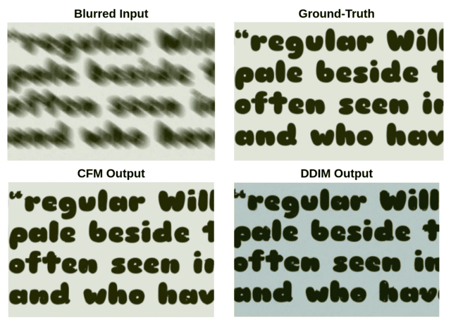

# Text Image Deblurring with Conditional Flow Matching



This repository contains the code and resources for a project on single-image text deblurring using Conditional Flow Matching (CFM). The goal is to restore clarity to blurred text images, a crucial task for applications like document analysis, Optical Character Recognition (OCR), and image-based search.

## Conditional Flow Matching (CFM) Overview

Conditional Flow Matching (CFM) `[1]` is a generative modeling technique that offers an alternative framework for training Continuous Normalizing Flows (CNFs) without the need to simulate full probability paths. CNFs learn an invertible mapping from a simple prior distribution (e.g., Gaussian) to a complex target data distribution, defined by an Ordinary Differential Equation (ODE):

$\frac{dx_{t}}{dt}=v_{t}(x_{t})$

The core idea of CFM is to reformulate the standard Flow Matching (FM) objective, which minimizes the difference between a learnable vector field and a target field, by using conditional probability paths $p_{t}(x|x_{0},x_{1})$ and conditional vector fields $u_{t}(x|x_{0},x_{1})$. Here, $x_{0}$ is sampled from the prior distribution and $x_{1}$ is sampled from the target data distribution. These conditional paths interpolate from $x_{0}$ to $x_{1}$, and their average recovers the desired marginal path $p_{t}(x)$.

The CFM objective is:

```math
\mathcal{L}_{CFM}(\theta)=\mathbb{E}_{t\sim U[0,1],x_{0}\sim p_{0},x_{1}\sim q,x\sim p_{t}(x|x_{0},x_{1})} [||v_{t}(x;\theta)-u_{t}(x|x_{0},x_{1})||^{2}]
```

This project specifically adopts **Independent Conditional Flow Matching (I-CFM)**, a variant where $x_{0}$ and $x_{1}$ are sampled independently. In I-CFM, the conditional paths are Gaussian:

$p_{t}(x|x_{0},x_{1})=\mathcal{N}(x|\mu_{t}(x_{0},x_{1}),\sigma_{t}^{2}I)$

with mean $\mu_{t}(x_{0},x_{1})=(1-t)x_{0}+tx_{1}$ and a constant standard deviation $\sigma_{t}=\sigma_{const}$. The corresponding conditional vector field is time-independent and state-independent:

$u_{t}(x|x_{0},x_{1})=x_{1}-x_{0}$

This results in a straight-line interpolation between samples, which contributes to stable and efficient training. I-CFM allows for simulation-free training of CNFs, leading to benefits such as faster convergence, reduced complexity, and strong performance in generative modeling.

### CFM Training Procedure

The model, a U-Net architecture `[2]` in this project, is trained to predict the time-dependent vector field $v_{t}(x;\theta)$ that transports samples from a prior distribution to the data distribution, conditioned on a blurred input image $y$. The training steps are as follows:

1.  **Path Sampling**:
    - For each sharp image $x_{1}$ and its corresponding blurred version $y$:
      - Sample a noise image $x_{0}\sim\mathcal{N}(0,I)$.
      - Sample a time $t \sim U[0,1]$.
      - Compute the intermediate point $x_{t}=(1-t)x_{0}+tx_{1}+\sigma\epsilon^{\prime}$, where $\epsilon^{\prime}\sim\mathcal{N}(0,I)$ and $\sigma=0.01$.
      - Define the target vector field $u_{t}(x_{t}|x_{0},x_{1})=x_{1}-x_{0}$.
2.  **Vector Field Prediction**: The U-Net model $v_{\theta}$ takes $x_{t}$, the time $t$ (as a continuous embedding), and the conditioning blurred image $y$ (concatenated along the channel dimension) as input. It outputs the predicted vector field $v_{\theta}(x_{t},t,y)$.
3.  **Loss Computation**: The objective is the mean squared error between the predicted and target vector fields:
    $\mathcal{L}_{I-CFM}=\mathbb{E}_{t,x_{0},x_{1},y}[||v_{\theta}(x_{t},t,y)-(x_{1}-x_{0})||^{2}]$
4.  **Optimization**: Model parameters are updated using the Adam optimizer.

### CFM Sampling Procedure

Once the U-Net $v_{\theta}$ is trained to predict the conditional vector field, a sharp image is generated from a blurred input $y$ by solving an ODE:

1.  **Initialization**: Sample an initial noise image $x_{0}\sim\mathcal{N}(0,I)$.
2.  **ODE Integration**: The sharp image $x_{1}$ is obtained by solving the initial value problem:
    $\frac{dx_{t}}{dt}=v_{\theta}(x_{t},t,y),$ with $x(0)=x_{0}$
    Integration is performed over $t \in [0,1]$. This project uses the Dormand-Prince 5 (DOPRI5) Runge-Kutta solver with adaptive step size `[3]`.
3.  **Final Output**: The solution at $t=1$, denoted $x_{1}$, is the generated deblurred image.

## Project Structure

The key files related to the Conditional Flow Matching implementation are:

- `src/deblur/cfm/cfm.py`: Contains the core implementation of the ConditionalFlowMatcher class, including methods for computing probability paths, conditional vector fields, and sampling.
- `src/deblur/train_cfm.py`: Script for training the CFM model for image deblurring. It handles data loading, model initialization, the training loop, validation, and checkpointing.
- `src/deblur/train_cfm_dist.py`: Script for distributed training of the CFM model using DDP (Distributed Data Parallel).
- `src/deblur/test_cfm.py`: Script for evaluating a trained CFM model. It loads a checkpoint, performs inference on a test set, and computes evaluation metrics.
- `src/models/unet.py`: Defines the U-Net architecture used as the backbone for the CFM model.
- `src/deblur/datasets/deblur.py`: Contains the `DeblurDataset` class for loading paired blurred and sharp images, and a function `make_deblur_splits` for creating training and validation dataset splits.

## How to Use

1.  **Dataset**: Prepare your dataset of blurred and sharp image pairs. The `DeblurDataset` class in `src/deblur/datasets/deblur.py` expects corresponding blurred and sharp images to have filenames that allow pairing (e.g., `image_001_blurred.png` and `image_001_sharp.png`). The dataset generation process in this project was inspired by various sources for text (`[4]`), fonts (`[5]`), and textures (`[6]`).
2.  **Training**:
    - For single GPU training, use `src/deblur/train_cfm.py`.
    - For distributed training, use `src/deblur/train_cfm_dist.py`.
    - Adjust parameters in the script's argument parser as needed, such as data paths, batch size, learning rate, model architecture, and CFM specific parameters (e.g., `cfm_sigma`).
3.  **Evaluation**:
    - Use `src/deblur/test_cfm.py` to evaluate a trained model checkpoint.
    - Provide paths to the checkpoint, blurred and sharp image directories, and configure ODE solver parameters.

## Results

The CFM model demonstrated strong performance in the text deblurring task. It achieved a PSNR of 25.93 dB and an SSIM of 0.72 on the test set. Notably, the CFM model converged faster during training (reaching its best PSNR in 14 epochs compared to 23 for a DDIM `[7]` baseline) and offered faster sampling times (20 seconds per image vs. 25 seconds for DDIM on an NVIDIA RTX 4060 Laptop GPU). These results highlight the efficiency and effectiveness of CFM for this image restoration task.

Qualitatively, the CFM model successfully reconstructed text with high fidelity, preserving font and letter structure even in challenging cases with strong blur and textured backgrounds.

For more details, please refer to the full [Report.pdf](Report.pdf).

## References

- `[1]` Tong, A., Fatras, K., Malkin, N., Huguet, G., Zhang, Y., Rector-Brooks, J., Wolf, G., & Bengio, Y. (2024). Improving and generalizing flow-based generative models with minibatch optimal transport. _TMLR_.
- `[2]` Dhariwal, P., & Nichol, A. (2021). Diffusion models beat gans on image synthesis. _NeurIPS_, _34_, 8780-8794.
- `[3]` Dormand, J. R., & Prince, P. J. (1980). A family of embedded Runge-Kutta formulae. _Journal of Computational and Applied Mathematics_, _6_(1), 19-26.
- `[4]` Project Gutenberg Literary Archive Foundation. (accessed 2025-05-09). www.gutenberg.org.
- `[5]` Google Fonts. (accessed 2025-05-09). github.com/google/fonts.
- `[6]` TextureLabs. (accessed 2025-05-09). texturelabs.org/.
- `[7]` Song, J., Meng, C., & Ermon, S. (2021). Denoising diffusion implicit models. In _ICLR_.
